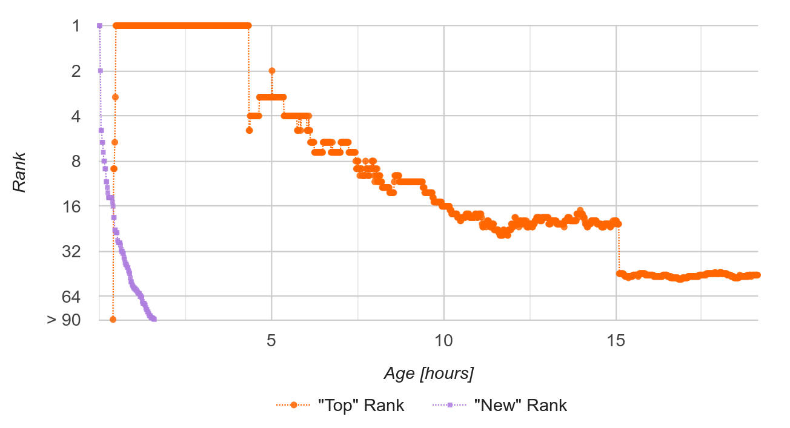
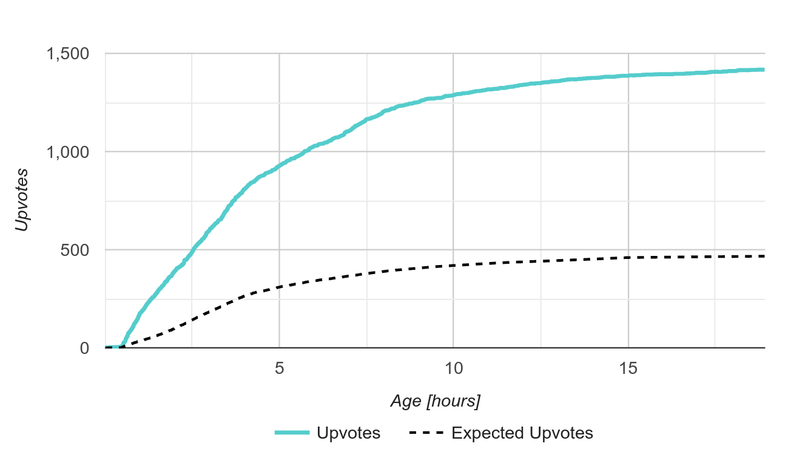
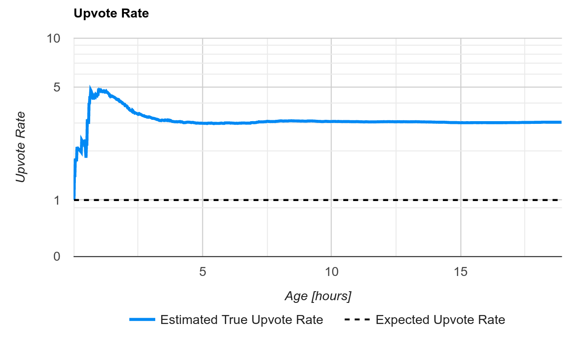

<h1 align="center" style="border-bottom: none">
    <div>
        <a href="https://news.social-protocols.org">
            
            <br>
            Quality News
        </a>
    </div>
    Towards a fair ranking algorithm for Hacker News
</h1>

<div align="center">
 


</div>

[Quality News](https://news.social-protocols.org) is a [Hacker News](https://news.ycombinator.com) client that provides additional data and insights on the **upvoteRate** of Hacker News stories.

As shown in our article on [Improving the Hacker News Ranking Algorithm](https://felx.me/2021/08/29/improving-the-hacker-news-ranking-algorithm.html), the number of upvotes alone is neither a comparable nor stable metric. The same story submitted multiple times receives vastly different amounts of upvotes every time.

In this work, we introduce a new metric, called `upvoteRate`, which aims to solve many of the problems of upvote counts. The `upvoteRate` quantifies how much more or less likely users are to upvote a story compared to the average story. `upvoteRate` is a more stable and comparable metric than raw upvotes. Two submissions that attract similar interest from the community should have a similar `upvoteRate`, regardless of:

- whether one of the stories got caught in a positive rank-upvote feedback loop (see Motivation below)
- the time/day of week a story was submitted
- overall amount of traffic to the site

The `upvoteRate` should thus better represent the aggregate intent of Hacker News community-members revealed by their upvotes.

Quality News uses live minute-by-minute rank and upvote data collected from Hacker News. It looks and behaves very similar to the original Hacker News site except it shows `upvoteRate` and other metrics next to each story, and charts with the history of each story's rank, upvotes, and estimated upvote rates. It is a lightweight, server-side rendered page written in [go](https://go.dev) and hosted on [fly.io](https://fly.io).

## Motivation

The success of a story on HN is partly a matter of timing and luck. A few early upvotes can catapult a new story to the front page where it can get caught in a feedback loop of even more upvotes. 


It is not always the best submissions that get caught in this feedback loop. We discussed some of our earlier thoughts on this problem in our article on [Improving the Hacker News Ranking Algorithm](https://felx.me/2021/08/29/improving-the-hacker-news-ranking-algorithm.html).

This is the current Hacker News ranking formula:

     rankingScore = pow(upvotes, 0.8) / pow(ageHours + 2, 1.8)

The problem is that it only considers 1) **upvotes** and 2) **age**. It doesn't consider 3) **rank** or 4) **timing**. So a story that receives 100 upvotes at rank 1 is treated the same as one that receives 100 upvotes at rank 30, even though a story on rank 1 receives more attention. And upvotes received during peak hours are treated the same as upvotes received in the middle of the night. This makes upvotes an unreliable metric for ranking.

Our goal is to provide a reliable metric, which can be used in the formula, replacing the raw upvote count. It accounts for the effects of rank and timing by giving upvotes received at high ranks and peak times less weight, eliminating the positive feedback loop.

This doesn't guarantee that some high quality stories won't sometimes be overlooked completely because nobody notices them on the new page. For those, we simply don't have enough data. We plan to approach this problem in the future.

## Upvote Share by Rank

We start by looking at historical upvote data on Hacker News for each rank and page type: `top` (front page), `new`, `best`, `ask`, and `show`. We obtained this data by [crawling the Hacker News API](https://github.com/social-protocols/hacker-news-data) every minute for several months, and recording each story's rank and score (upvote count). The change in score tells us approximately how many upvotes occured at that rank during that time interval.

We then calculated the *share* of overall site-wide upvotes that occur at each rank. For example, the first story on the `top` page receives on average about 10.2% of all upvotes (about 1.169 upvotes per minute), whereas the 40th story on the `new` page receives about 0.05% (about 0.0055 upvotes per minute). Upvote shares for the `top` page is summarized in the chart below.


<!--from the hacker-news-data database: 
    select 
        rank as topRank
        , round(avgUpvotes, 3) as avgUpvotes
        , round(avgUpvotes/(select sum(avgUpvotes) from upvotesByRank),3) as avgUpvoteShare 
    from upvotesByRank 
    where rank in (1,2,3,10,40,80) and pageType = 'top';
-->


| topRank   | avgUpvotes   | avgUpvoteShare |
| --------  | ------------ | -------------- |
| 1         | 1.169        | 10.2%          |
| 2         | 0.698        | 6.1%           |
| 3         | 0.538        | 4.7%           |
| ...       |              | ...            |
| 10        | 0.274        | 2.4%           |
| ...       |              | ...            |
| 40        | 0.043        | 0.4%           |
| ...       |              | ...            |
| 80        | 0.013        | 0.1%           |
| **TOTAL** | **11.493**   | **100%**       |


## Expected Upvotes Over Time


If we multiply the average upvote share for a rank by the total site-wide upvotes during some specific time interval, we get the number of expected upvotes for that rank and time interval. Or to be more precise, we get the number of upvotes **we would expect the average story to receive** at that rank during that time interval.

    expectedUpvotes[rank, timeInterval]
        = avgUpvoteShare[rank] * sidewideUpvotes[timeInterval]




Given **a history of the story's rank over time**, we can compute its total expected upvotes:

    totalExpectedUpvotes
        = sum{for each timeInterval} expectedUpvotes[rank[timeInterval], timeInterval]



## The "True" Upvote Rate

We assume that each story has some "true" upvote rate, which is a factor of how much more or less likely users are to upvote that story than the average story. During each time interval, each story should receive, on average, the expected upvotes for the rank it was shown at times the story's true upvote rate:

    upvotes[timeInterval]
        ≈ upvoteRate * expectedUpvotes[rank[timeInterval], timeInterval]

The relationship `upvotes ≈ upvoteRate * expectedUpvotes` holds even in the aggregate, independently of the ranks at which upvotes actually occurred. This can be seen by taking the sum of a story's upvotes across all time intervals:

    totalUpvotes = sum{for each timeInterval} upvotes[timeInterval]
                 = sum{for each timeInterval} upvoteRate * expectedUpvotes[rank[timeInterval], timeInterval]
                 ≈ upvoteRate * sum{for each timeInterval} expectedUpvotes[rank[timeInterval], timeInterval]
                 ≈ upvoteRate * totalExpectedUpvotes

This means we can estimate the true upvote rate simply by dividing the story's total upvotes by its total expected upvotes:

    upvoteRate ≈ totalUpvotes / totalExpectedUpvotes

We call this estimate the **observed upvote rate**.



## Bayesian Averaging

If we don't have a lot of data for a story, the observed upvote rate may not be a very accurate estimate of the true upvote rate.

A more sophisticated approach uses Bayesian inference: given our prior knowledge about the distribution of upvote rates, plus the evidence we have observed about this particular story, what does Bayes' rule tell us is the most probable true upvote rate?

Since there are infinitely many possible true upvote rates, we can't use a trivial application of Bayes rule. But we can estimate the most likely true upvote rate using a technique called Bayesian Averaging. Here is good explanation of this technique from [Evan Miller](https://www.evanmiller.org/bayesian-average-ratings.html).

The Bayesian Averaging formula in our case is:

    estimatedUpvoteRate ≈ (totalUpvotes + strengthOfPrior) / (totalExpectedUpvotes + strengthOfPrior)

Where `strengthOfPrior` is a constant we have estimated to be about 2.3 using an MCMC simulation. 

## A Proposed New Formula

The following is a proposed alternative Hacker News ranking formula based on the estimated true upvote rate.

    newRankingScore
        = pow(age * estimatedUpvoteRate, 0.8) / pow(age + 2, 1.8)

This formula simply substitutes `age * estimatedUpvoteRate` for `upvotes` in the original Hacker News ranking formula. Since, in general, `upvotes` is roughly proportional to `age * estimatedUpvoteRate`, this approximates the ranking score a story *should have* given its upvote rate and age.

## Problem: Penalties and Bonuses

Unfortunately, the actual Hacker News ranking score is further adjusted based on various factors including flags, moderator penalties and bonuses, URL, and number of comments. Although we know or can guess about some of these factors, data on flags and moderator actions are not publicly available. This means we can't actually reproduce the Hacker News ranking score, and therefore cannot modify it to show what the Hacker News front page would look like using our new formula.

Although we have made some attempts to automatically infer penalties and bonuses based on differences between a story's actual rank and raw rank, the results have been questionable so far. 


## Possible Improvements


### Fatigue

In general, upvote rates decrease as a story receives more attention. The more attention a story has received, the more likely it is that users have already seen it. So if a story spends a lot of time on  home page the upvote rate will eventually start to drop.

But we'd like a true upvote rate estimate that measures the tendency of the story itself to attract upvotes, and not the amount of attention it has received on Hacker News. We can do this by building a fatigue factor into the expected upvote model.

### Moving Averages

Looking only at more recent data could make vote manipulation even harder: it would require a constant supply of new votes as the moving average window moves.

The moving average window would be based on expected upvotes, not time, since expected upvotes is roughly proportional to the number of people who have *paid attention* to a story and thus can be thought of as a proxy for sample size

# Development

The application is a single Go process that crawls the [Hacker News API](https://github.com/HackerNews/API) every minute. For each story, it records the current rank and page (top, new, best, etc.), and how many upvotes it has received, computes the expected upvotes share for that rank and updates the accumulated expected upvotes for that story. The data is stored in a Sqlite database.

The frontpage generator queries the database and calculates the Bayesian average upvote rate in the SQL query. It then uses the Go templating library to generate HTML that mimics the original HN site. The frontpage is regenerated every minute and served compressed directly from memory.

## Running it locally

Make sure, you have:

- go 1.19+
- [direnv](https://direnv.net/) - to set environment variables automatically
- entr - to automatically rerun server when files change
- sqlite3

Run:

```sh
git clone github.com/social-protocols/news
cd news

source .envrc # if you don't have direnv installed

go get
```

Then:

```sh
go run *.go
```

Or, to automatically watch for source file changes:

```sh
./watch.sh
```

### Using NIX

There is also a [shell.nix](shell.nix) available, which provides all required dependencies.

Install nix on your system, enter the news directory, and run:      

```sh 
git clone github.com/social-protocols/news
cd news
nix-channel --update
nix-shell
./watch.sh
```

# Contributions

All contributions are welcome! Please open issues and PRs.
