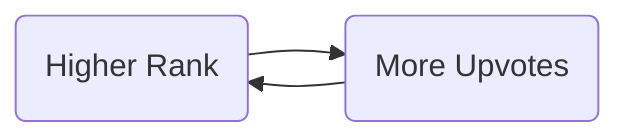
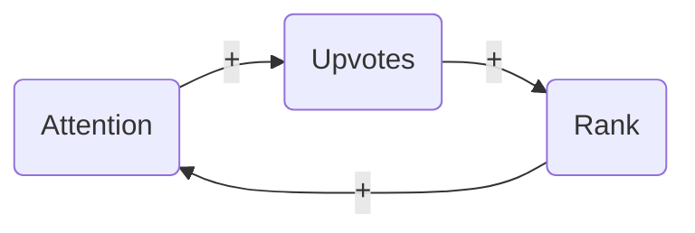
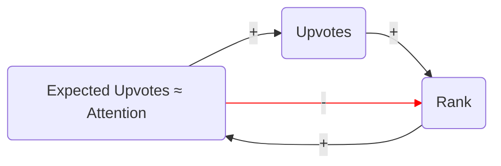

<h1 align="center" style="border-bottom: none">
    <div>
        <a href="https://news.social-protocols.org">
            
            <br>
            Quality News
        </a>
    </div>
    A fair ranking algorithm for Hacker News
</h1>

<div align="center">
 


</div>


## About

[Quality News](https://news.social-protocols.org) implements a new ranking formula for Hacker News, designed to give stories the attention they deserve.

The formula uses minute-by-minute rank and upvote data collected from Hacker News to adjust score based on the ranks and times at which upvotes occurred.

## Motivation

The success of a story on HN is partly a matter of timing and luck. A few early upvotes can catapult a new story to the front page where it can get caught in a feedback loop of even more upvotes. 



It is not always the best submissions that get caught in this feedback loop. We discussed some of earlier thoughts on this problem in our article on [Improving the Hacker News Ranking Algorithm](https://news.ycombinator.com/item?id=28391659).

This is the current hacker news ranking formula:

     rankingScore = pow(upvotes, 0.8) / pow(ageHours + 2, 1.8)

The problem is that it only considers 1) **upvotes** and 2) **age**. It doesn't consider 3) **rank** or 4) **timing**. So a story that receives 100 upvotes at rank 1 is treated the same as one that receives 100 upvotes at rank 30. And upvotes received during peak hours are treated the same as upvotes received in the middle of the night.

Our solution is to account for the effects of rank and timing by giving upvotes received at high ranks and peak times less weight, eliminating the positive feedback loop.

This doesn't guarantee that some good stories won't be missed, because the "new" page generally gets little attention and many stories are overlooked completely. We plan to approach this problem in the future.

This doesn't guarantee that some high quality stories won't sometimes be overlooked completely because nobody notices them on the new page. We plan to approach this problem in the future.

## Upvote Share by Rank

We start by looking at historical upvotes on Hacker News for each rank and page type: `top` (front page), `new`, `best`, `ask`, and `show`. We obtained this data by [crawling the hacker news API](https://github.com/social-protocols/hacker-news-data) every minute for several months, and recording each story's rank and score. The change in score tells us approximately how many upvotes occured at that rank.

We then calculated the *share* of overall site-wide upvotes that occur at each rank. For example, the first story on the `top` page receives on average about 10.2% of all upvotes (about 1.169 upvotes per minute), whereas the 40th story on the `new` page receives about 0.05% (about 0.0055 upvotes per minute). Upvote shares for the `top` page is summarized in the chart below.


<!--from the hacker-news-data database: 
    select 
        rank as topRank
        , round(avgUpvotes, 3) as avgUpvotes
        , round(avgUpvotes/(select sum(avgUpvotes) from upvotesByRank),3) as upvoteShare 
    from upvotesByRank 
    where rank in (1,2,3,10,40,80) and pageType = 'top';
-->


| topRank  | avgUpvotes   | upvoteShare |
| -------- | ------------ | ----------- |
| 1        | 1.169        | 10.2%       |
| 2        | 0.698        |  6.1%       |
| 3        | 0.538        |  4.7%       |
| ...      |              | ...         |
| 10       | 0.274        |  2.4%       |
| ...      |              | ...         |
| 40       | 0.043        |  0.4%       |
| ...      |              | ...         |
| 80       | 0.013        |  0.1%       |
| **TOTAL**| **11.493**   |  **100%**   |


## Expected Upvotes


If we multiply the upvote share for a rank by the total site-wide upvotes during some time interval, we get the number of expected upvotes for that rank and time interval. Or to be more precise, we get the number of upvotes **we would expect the average story to receive** at that rank during that time interval.

    expectedUpvotes[rank, timeInterval]
        = upvoteShare[rank] * sidewideUpvotes[timeInterval]

Given a history of the story's rank over time, we can compute its total expected upvotes:

    totalExpectedUpvotes
        = sum{for each timeInterval} expectedUpvotes[rank[timeInterval], timeInterval]


## The "True" Upvote Rate

We assume that each story has some "true" upvote rate, which is a factor of how much more or less likely users are to upvote that story than the average story. During each time interval, each story should receive, on average, the expected upvotes for the rank it was shown at times the story's true upvote rate:

    upvotes[timeInterval]
        ≈ upvoteRate * expectedUpvotes[rank[timeInterval], timeInterval]

The relationship `upvotes ≈ upvoteRate * expectedUpvotes` holds even in the aggregate, independently of the ranks at which upvotes actually occurred. This can be seen by taking the sum of a story's upvotes across all time intervals:

    totalUpvotes = sum{for each timeInterval} upvotes[timeInterval]
                 = sum{for each timeInterval} upvoteRate * expectedUpvotes[rank[timeInterval], timeInterval]
                 ≈ upvoteRate * sum{for each timeInterval} expectedUpvotes[rank[timeInterval], timeInterval]
                 ≈ upvoteRate * totalExpectedUpvotes

This means we can estimate the true upvote rate simply by dividing the story's total upvotes by its total expected upvotes:

    upvoteRate ≈ totalUpvotes / totalExpectedUpvotes

We call this estimate the **observed upvote rate**.

## Bayesian Averaging

If we don't have a lot of data for a story, the observed upvote rate may not be a very accurate estimate of the true upvote rate.

A more sophisticated approach uses Bayesian inference: given our prior knowledge about the distribution of upvote rates, plus the evidence we have observed about this particular story, what does Bayes' rule tell us is the most probable true upvote rate?

The resulting estimated true upvote rates will always fall somewhere between the average upvote rate (1.0) and the observed upvote rate (`totalUpvotes/totalExpectedUpvotes`). Our prior assumption about a new story is that it is average. Then as the we collect more data our estimate approaches the observed upvote rate. For example, if expected upvotes is 1 and observed upvotes is 2, then the observed upvote rate is 2.0, but the estimated upvote rate will sill be closer to 1.0 because we don't have a lot of evidence. But if expected upvotes is 100 and observed upvotes is 200, the evidence is pretty strong, and the estimated upvote rate will be closeer to 2.0. 

In fact, the estimate will always be a simple weighted average of the observed upvote rate (the data) and the prior of 1.0, where the weights are the number of expected upvotes and a constant representing the strength of the prior. Expected upvotes is roughly proportional to the number of people who have *paid attention* to a story, and thus can be thought of as a proxy for sample size. The constant representing the strength of the prior is the sample size necessary for the data to have more weight than the prior.

Using an MCMC simulation to estimate this constant, we can calculate the estimated upvote rate for each story using the sample formula below. This technique is known as [Bayesian averaging](https://en.wikipedia.org/wiki/Bayesian_average)

    U = totalUpvotes
    E = totalExpectedUpvotes
    W = weight of prior
                        
                             data     prior
                              ↓        ↓
     estimatedUpvoteRate ≈ ( U/E * E + 1 * W ) / (E + W)
                                   ↑       ↑        ↑
                                 weight  weight   total
                                   of      of     weight
                                  data   prior
                                                
                         ≈ (U + W) / (E + W)


## Adjusted Upvotes

We can now incorporate `estimatedUpvoteRate` into a new ranking formula that rewards stories not just for receiving more upvotes, but for receiving *more upvotes than expected*. 

However, we cannot simply plug `estimatedUpvoteRate` into the HN ranking formula in place of `upvotes`. To see why, let's look at the HN ranking formula again:

     rankingScore = pow(upvotes, 0.8) / pow(ageHours + 2, 1.8)

Since the denominator is constantly increasing as time passes, then for a story to maintain a high rank, the numerator must also be increasing at roughly the same rate. If we simply substituted `estimatedUpvoteRate` for `upvotes` in the above formula, the numerator would stop increasing even though time would not stop passing, and so `rankingScore` would fall very rapidly. The result would be a front page full of only the newest stories.

So to make our formula behave as much like the HN formula as possible, the numerator should grow at roughly the same rate as it does in the current ranking formula. 

It's easy to see that, for the average story, upvotes increase linearly with time, and thus with age. And the rate of increase must be higher for stories with greater `estimatedUpvoteRate`. 


So a story that is `age` hours old should typically receive roughly `estimatedUpvoteRate*age*c` upvotes, where the constant `c` is the same for all stories. We call this number `adjustedUpvotes`, and it can be thought of as the number of upvotes a story *should* receive if it got neither more nor less attention than it deserved.

<!--TODO: this is not right. We should have a higher exponent on estimatedUpoteRate because the algorithm favors high upvote rates. In fact it should be a power law distribution-->

## New Ranking Formula:

So we can now substitute `adjustedUpvotes` into the HN ranking formula:

     newRankingScore = pow(adjustedUpvotes, 0.8) / pow(ageHours + 2, 1.8)
                     = pow(estimatedUpvoteRate * age * c, 0.8) / pow(age + 2, 1.8)
                     = pow(c, 0.8) * pow(estimatedUpvoteRate * age, 0.8) / pow(age + 2, 1.8)

We then drop the constant `pow(c, 0.8)` and substitute in our Bayesian average estimate of the upvote rate, to get our final ranking formula:

    newRankingScore
        = pow(age * (totalUpvotes + priorWeight) / (totalExpectedUpvotes + priorWeight), 0.8) / pow(age + 2, 1.8)


## Discussion: Expected Upvotes as Proxy for Attention

We expect more upvotes for stories shown at high ranks during peak times because they receive more **attention**. Now we don't have any way to directly measure or even precisely define "attention" (we don't know what's going on in users's heads), but we know that the number of upvotes the average story receives must be roughly proportional to the amount of attention it receives (though the upvote rate tends to decrease gradually as the story ages). So expected upvotes is a *proxy* for attention. 

With the current HN ranking formula, stories that receive a lot of early upvotes while the time penalty is still low can be ranked very high and thus receive more attention, which results in a feedback loop of even more upvotes (the rich get richer) until the quadratic age penalty finally dominates the ranking score. The effect of this feedback loop can overwhelm the effect of the story's true upvote rate.



Our proposed algorithm balances this feedback loop by giving expected upvotes -- our proxy for attention -- a direct negative effect on rank.




So a story that gets a lot of upvotes early on will initially enjoy a higher rank and more attention, but this increased attention is a mixed blessing, because now the story is expected to receive more upvotes. In fact, the faster a story accumulates attention, the more quickly this effect kicks in.

If a story doesn't really deserve to be on the front page because it has a low true upvote rate, more attention just will just cause the Bayesian average estimated true upvote rate to converge to the true upvote rate more quickly. This makes it difficult to manipulate rank: a lot of early upvotes may be sufficient to get the story onto the front page, but not to keep it there.

A large enough number of bots or colluding users can still distort the results. But we think overall this ranking formula should do a better job of giving stories the attention they deserve, reducing both over-ranked and under-ranked stories.

## Penalties

Our first implementation of this ranking algorithm immediately revealed a problem: the front page was dominated by non-technical stories. These was mostly major main-stream news headlines that had little to do with ["hacking and startups"](https://news.ycombinator.com/newsguidelines.html).

Hacker News applies penalties to many main-stream news stories, causing them to be ranked lower than they would otherwise given their ranking score. Even though the HN community was formed around the topic of hacking and topics, it is full of curious people with a variety of interests, and it is natural that they will find value in discussing a wide range of topics. But in the long term communities can lose their value if they don't artificially focus the discussion. It seems like HN has arrived at a good compromise that quietly down-ranks off-topic articles while still allowing them, so that the community remains focused, but people also derive value from discussing other topics that truly interest them.

Unfortunately, Hacker News does not publish penalties or their method for applying them. Our initial attempt at reverse-engineering HN penalties was based on a method similar to the one described in this [blog post from 2013](https://www.righto.com/2013/11/how-hacker-news-ranking-really-works.html). We have since implemented logic that attempts to reproduce HN penalties as measured as a ratio of their expected rank to their actual rank.

Our logic successfully demotes most off-topic stories, though it does miss off-topic stories that have not yet been penalized by the HN editors because they have not yet made the HN home page (even though they have made the QN home page). Estimated penalties can be seen in the last chart of the story stats pages (which you get to by clicking on the blue upvote rate under the story). [For example](https://news.social-protocols.org/stats?id=33962083). You can also see the result of the QN ranking algorithm with [penalties removed](https://news.social-protocols.org/?penaltyWeight=0.001) or [negative penalties](https://news.social-protocols.org/?penaltyWeight=-1).


## Possible Improvements


### The Causal Model

One improvement would be to properly account for **causality**. The formula for `estimatedUpvoteRate` makes some implicit assumptions about the causal relationship between the rank a story is shown at, and the number of upvotes it receives. These assumptions are not quite correct. As a result there are systematic errors in our upvote rate estimates that could be corrected by making appropriate statistical adjustments.

Just as more deaths occur in hospitals because society sends sick people to hospitals, and not necessarily because hospitals cause people to die, more upvotes occur at higher ranks because the HN ranking algorithm sends the highest-scoring stories to higher ranks. So when we look at the number of upvotes that historically occur at different ranks, we need to consider that this is due to the *combined* effect of the algorithm, and the actual effect of rank on upvotes.

This is a problem because our upvote rate calculation depends on an estimate of the number of upvotes we would expect *the average story* to receive at each rank. But the data in our `upvoteShare`  table don't tell us this. Instead it tells us how many upvotes actually occured at each rank. But the *average* story was not shown at each rank. Above average stories are generally shown at higher ranks, and below-average stories are generally shown at lower ranks.

So we don't know how many many more upvotes the average story *should* receive at rank 1 than at rank 90, just by looking at the historical averages.

Fortunately, there are statistical techniques for adjusting for these sorts of [confounding](https://en.wikipedia.org/wiki/Confounding) variables and estimating the direct effect of rank on upvotes. Applying these is tricky in this case, but we hope to update our algorithm with an updated `expectedUpvoteRate` table soon.

<!--
A story's upvote rate is by definition a factor of how many more or fewer upvotes a story gets than an average story would have gotten if shown at the same rank. For example, if a story received 3 upvotes during a minute at rank 1, then we need to divide 3 by the number of upvotes we would expect the average story to receive during a minute at rank 1. But we don't how many upvotes the average story gets during a minute at rank 1! Because the average story never makes it to rank 1; the historical upvotes at rank 1 only include data for above-average stories.
-->

### Fatigue

In general, upvote rates decrease as a story receives more attention. The more attention a story has received, the more likely it is that users have already seen it. So if a story spends a lot of time on  home page the upvote rate will eventually start to drop. 

But we'd like a true upvote rate estimate that measures the tendency of the story itself to attract upvotes, and not the amount of attention it has received on Hacker News. We can do this by building a fatigue factor into the expected upvote calculation.

### Moving Averaging

Looking only at more recent data could make vote manipulation even harder: it would require a constant supply of new votes as the moving average window moves.

The moving average window would be based on expected upvotes, not time, since expected upvotes can be thought of a proxy for sample size (as discussed in the [Bayesian Averaging](#bayesian-averaging) section above).

# Development

The application is a single Go process that crawls the [Hacker News API](https://github.com/HackerNews/API) every minute. For each story, it records the current rank and page (top, new, best, etc.), and how many upvotes it has received, computes the expected upvotes share for that rank and updates the accumulated expected upvotes for that story. The data is stored in a Sqlite database.

The frontpage generator queries the database and calculates the Bayesian average upvote rate in the SQL query. It then uses the Go templating library to generate HTML that mimics the original HN site. The frontpage is regenerated every minute and served compressed directly from memory.

## Running it locally

Make sure, you have:

- go 1.19+
- [direnv](https://direnv.net/) - to set environment variables automatically
- entr - to automatically rerun server when files change
- sqlite3

Run:

```sh
git clone github.com/social-protocols/news
cd news

source .envrc # if you don't have direnv installed

go get
```

Then:

```sh
go run *.go
```

Or, to automatically watch for source file changes:

```sh
./watch.sh.
```

### Using NIX

There is also a [shell.nix](shell.nix) available, which provides all required dependencies.

Install nix on your system, enter the news directory, and run:      

```sh 
    git clone github.com/social-protocols/news
    cd news
    nix-channel --update
    nix-shell
    ./watch.sh
```

# Contributions

All contributions are welcome! Please open issues and PRs.
