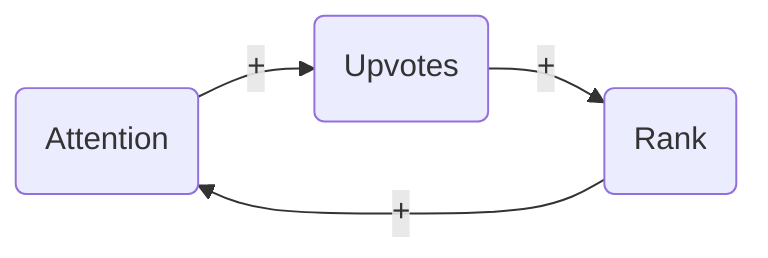
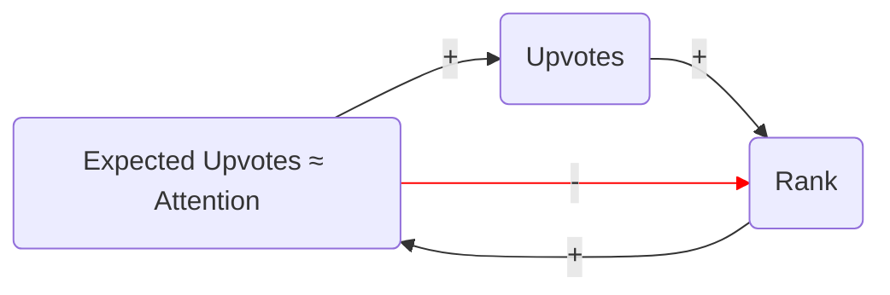

# About

[Quality News](https://social-protocols-news.fly.dev/) implements a new ranking formula for Hacker News, designed to give stories the attention they deserve.

It tracks all submission and vote information from HN and incorporates that information into our new formula. This means, we can show great content from the beginning, without bootstrapping our own community.

## Motivation

The success of a story on HN is partly a matter of timing and luck. A few early upvotes can catapult a new story to the front page where it can get caught in a feedback loop of even more upvotes. 


It is not always the best submissions that get caught in this feedback loop. We discussed this in our article on [Improving the Hacker News Ranking Algorithm](https://felx.me/2021/08/29/improving-the-hacker-news-ranking-algorithm.html).

This is the current hacker news ranking formula:

     rankingScore = pow(upvotes, 0.8) / pow(ageHours + 2, 1.8)

The problem is that it only considers 1) **upvotes** and 2) **age**. It doesn't consider 3) **timing** or 4) **rank**. So a story that receives 100 upvotes at rank 1 is treated the same as one that receives 100 upvotes at rank 30. And upvotes received during peak hours US time are treated the same as upvotes received in the middle of the night.

Our solution is to account for the effects of rank and timing, giving upvotes received at high ranks and peak times less weight.

Note, that in this work we're not solving the problem of overlooked stories. We'll approach this problem in the future.

## Upvote Share by Rank

We start by looking at historical upvotes on Hacker News for each rank and page type (top/home, new, ask, etc.). For example, the first story on the "top" page receives on average about `10.2%` of all  upvotes (about `1.17` upvotes per minute), whereas the 40th story on the "new" page receives about `0.05%` of upvotes (about `0.0055` upvotes per minute). We call this number `upvoteShare`.

We calculated `upvoteShare` for different ranks and page types by [crawling the hacker news API](https://github.com/social-protocols/hacker-news-data) every minute for several months, and recording each story's rank and score. We then made some adjustments for the fact that stories may appear on more than one page type during that minute.

Here are some results for a handful of ranks for the HN front page.

| top-rank | upvoteShare |
|----------|-------------|
| 1        | 0.10171544  |
| 2        | 0.06069524  |
| 3        | 0.04676849  |
| ...      | ...         |
| 10       | 0.02380067  |
| ...      | ...         |
| 50       | 0.00290519  |
| ...      | ...         |
| 80       | 0.00110132  |


The following plot shows the upvoteShare in log-scale separately for page 1, 2 and 3. Looking at pages separately makes sense, because every page has more visibility and therefore upvotes at the top ranks than at the bottom. Drawing a regression line in log-scale shows how well we can model those numbers with an exponential decay:


## The Causal Model

But do stories at high ranks get more upvotes **because** they are shown at high ranks? Or are the stories shown at high ranks **because** they get more upvotes? Or both?

Here is an over-simplified hypothetical causal graph, based on some common sense assumptions:

          story      
        ↙       ↘
     rank   →  upvotes


Story is a confounding variable: it has a direct effect on upvotes, but because the ranking algorithm favors more up-votable stories, it also has a direct effect on rank. This means that even if rank had no direct effect on upvotes, there would be a correlation between rank and upvotes in the data!

Isolating the **direct causal effect** of rank on upvotes is important, because to properly adjust a story's score for rank, we need to know how many upvotes a story received **because** of the rank it was shown at, and how many it received **because** of how up-votable is is. 

We plan to publish another writeup on our approach to isolating the causal effect of rank on upvotes. 

Solving this problem tells us the share of upvotes that we would **expect** at each rank **if the ranking algorithm where completely random**.

## Expected Upvotes


So if we simply multiply expected upvote share at a rank by the total site-wide upvotes during some time interval, we get the number of upvotes **we would expect the average story to receive** at that rank during that time interval.

    expectedUpvotes[rank, timeInterval]
        = expectedUpvoteShare[rank] * sidewideUpvotes[timeInterval]

Given a history of the story's rank over time, we can compute its total expected upvotes:

    totalExpectedUpvotes
        = sum{for each timeInterval} expectedUpvotes[rank[timeInterval], timeInterval]

## The "True" Upvote Rate

We assume that each story has some "true" upvote rate, which is a factor of how much more or less likely users are to upvote that story than the average story. During each time interval, each story will receive the on average expected number of upvotes times its true upvote rate.

    upvotes[timeInterval]
        ≈ upvoteRate * expectedUpvotes[rank[timeInterval], timeInterval]

We assume that the relationship `upvotes ≈ upvoteRate * expectedUpvotes` holds even in the aggregate, regardless of the ranks at which upvotes actually occurred.

    totalUpvotes = sum{for each timeInterval} upvotes[timeInterval]
        = sum{for each timeInterval} upvoteRate * expectedUpvotes[rank[timeInterval], timeInterval]
        ≈ upvoteRate * sum{for each timeInterval} expectedUpvotes[rank[timeInterval], timeInterval]
        ≈ upvoteRate * totalExpectedUpvotes

Thus the **observed** upvote rate is an approximation of the true upvote rate:

    upvoteRate ≈ totalUpvotes / totalExpectedUpvotes


## Bayesian Averaging

If we don't have a lot of data for a story, the observed upvote rate may be more a reflection of pure chance than of the true upvote rate.

A more sophisticated approach uses Bayesian inference: given our prior knowledge about the distribution of upvote rates, plus the evidence we have about this particular story, what does Bayes' rule tell us is the most probable true upvote rate?

Since the probability distribution in this case is continuous and complicated, Bayes rule actually can't be evaluated analytically using pen-on-paper math. Instead we run a Markov Chain Monte Carlo simulation in STAN on our Bayesian model to estimate the true upvote rate for each story given the data.

When we run this model we find that the true upvote rate estimates [**shrink**](https://www.statisticshowto.com/shrinkage-estimator/): they fall somewhere between the observed upvote rate (`totalUpvotes/totalExpectedUpvotes`) and 1.0. The more data we have for each story, the closer the estimate is to the observed upvote rate. 

In fact, the posterior is always just a weighted average of the observed upvote rate and the prior of 1.0. The weights are, respectively, the number of expected upvotes, and a constant representing the strength of the prior. If we know this constant, we can then estimate upvoteRate using the following formula -- a technique known as [Bayesian averaging](https://en.wikipedia.org/wiki/Bayesian_average).
      
    U = totalUpvotes
    A = totalExpectedUpvotes
    W = weight of prior
                        
                     data     prior
                      ↓        ↓  
      upvoteRate ≈ ( U/A * A + 1 * W ) / (A + W) ≈ (totalUpvotes + weight) / (totalExpectedUpvotes + weight)
                           ↑       ↑        ↑
                         weight  weight   total
                           of      of     weight
                          data   prior 

<!--
TODO: why is A = weight of data?
//-->


## Hypothetical Upvotes


<!--
TODO: describe what's the goal here.
The total number of upvotes of a story is not a useful metric to ...
//-->

Now that we have an estimate for the true upvote rate for a story, we can estimate how many upvotes that story would have received if it had the same history as the average story. At each time interval, the average story received `sidewideUpvotes[timeInterval]/nStories` upvotes. So a story with a given upvoteRate would hypothetically have received:

    hypotheticalUpvotes
        = sum{for each timeInterval} upvoteRate * sidewideUpvotes[timeInterval]/nStories 
        = upvoteRate * sum{for each timeInterval} * sidewideUpvotes[timeInterval]/nStories 
        = upvoteRate * age * c

Where the constant `c` is the same for all stories. 

## New Ranking Formula:

We can now substitute `hypotheticalUpvotes` into the HN ranking formula:

     newRankingScore = pow(hypotheticalUpvotes, 0.8) / pow(ageHours + 2, 1.8)
                     = pow(upvoteRate * age * c, 0.8) / pow(age + 2, 1.8)
                     = pow(c, 0.8) * pow(upvoteRate * age, 0.8) / pow(age + 2, 1.8)

We then drop the constant `pow(c, 0.8)` and substitute in our Bayesian average estimate of the upvote rate, to get our final ranking formula:

    newRankingScore
        = pow((totalUpvotes + weight) / (totalExpectedUpvotes + weight) * age, 0.8) / pow(age + 2, 1.8)


## Discussion: Expected Upvotes as Proxy for Attention

We expect more upvotes for stories shown at high rank during peak times because they receive more **attention**. Now we don't have any way to directly measure or even precisely define "attention" (we don't know what's going on in users's heads), but we know that the number of upvotes the average story receives must be roughly proportional to the amount of attention it receives (though there is a small attention fatigue factor). So expected upvotes is a *proxy* for attention. 

With the current HN ranking formula, stories that receive a lot of early upvotes while the time penalty is still low can be ranked very high and thus receive more attention, which results in a feedback loop of even more upvotes (the rich get richer) until the quadratic age penalty finally dominates the ranking score. The effect of this feedback loop can overwhelm the effect of the story's true upvote rate.



Our proposed algorithm balances this feedback loop by giving expected upvotes -- our proxy for attention -- a direct negative effect on rank.




So a story that gets a lot of upvotes early on will initially enjoy a higher rank and more attention, but this increased attention is a mixed blessing, because now the story is expected to receive more upvotes in proportion to the increased attention. In fact, the more initial success a story has, the quicker the negative penalty from expected upvotes will catch up to the benefits of additional attention. A story must have a high true upvotes rate among the average visitor to the Hacker News home page to sustain a high rank.

A large enough number of bots or colluding users can still distort the results. And many good stories will still be overlooked, because there are just too many stories: an above-average story needs several upvotes before there is enough information to overwhelm the weight of the prior assumption of average quality, but there are not necessarily enough people looking at the new-page (thus the [second chance pool](https://news.ycombinator.com/item?id=11662380)) to provide these upvotes.

But we think overall this ranking formula should do a better job of giving stories the attention they deserve, reducing both over-ranked and under-ranked stories.

## Penalties for Off-Topic Stories

When we first built this, we immediately noticed a greater proportion of non-technical stories: mostly major news items from main-stream media that had little to do with ["hacking and startups"](https://news.ycombinator.com/newsguidelines.html). We reasoned that this was because Hacker News applies penalties to many main-stream news stories, but we didn't incorporate those penalties into our ranking algorithm. Here's a [blog post from 2013](https://www.righto.com/2013/11/how-hacker-news-ranking-really-works.html) that attempts to reverse-engineer these penalties


It is natural that, once a community has formed around some topic, they will come to want to discuss unrelated topics with that same community. Perhaps in the *short-term*, people gain the most value from discussing whatever topic interests them, but in the long term communities lose their value if they don't artificially focus the discussion. We believe HN has arrived at a compromise that quietly penalizes off-topic articles while still allowing them, so that the community remains focused on "hacking and startups", but people also derive value from discussing other topics that truly interest them.

We are going to look into [inferring penalties and applying them](https://github.com/social-protocols/news/issues/47) on Quality News. But in the meantime, we think that's why you see more off-topic content.


# Development

The application is a single Go process that crawls the [Hacker News API](https://github.com/HackerNews/API) every minute. For each story, it records the current rank and page (top, new, best, etc.), and how many upvotes it has received, computes the expected upvotes share for that rank and updates the accumulated expected upvotes for that story. The data is stored in a Sqlite database.

The frontpage generator queries the database and calculates the Bayesian average upvote rate in the SQL query. It then uses the Go templating library to generate very simple HTML that mimics the original HN site. The frontpage is regenerated every minute and served compressed directly from memory.

## Running it locally

Make sure, you have
- go 1.18+
- [direnv](https://direnv.net/) - to set environment variables automatically

There is also a [shell.nix](shell.nix) available, which provides all required dependencies.


```sh
# if you don't have direnv installed:
source .envrc

go run *.go
```

# Contributions

All contributions are welcome! Please open issues and PRs.
